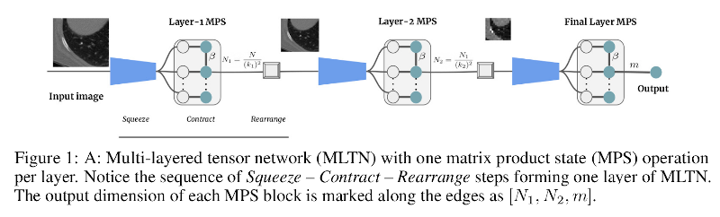

# README #

This is the official Pytorch implementation of 
"[Multi-layered tensor networks for image classification](https://arxiv.org/abs/2011.06982)", Raghavendra Selvan et al. 2020



### What is this repository for? ###

* Run and reproduce results in the paper on LIDC dataset
* v1.0


### How do I get set up? ###

* Basic Pytorch dependency
* Tested on Pytorch 1.3, Python 3.6 
* Download the data from [here](https://bitbucket.org/raghavian/lotenet_pytorch/src/master/data/lidc.zip)
* Unzip the data and point the path to --data_path
* How to run tests: python train.py --data_path data_location --mltn --bn 

### Usage guidelines ###

* Kindly cite our publication if you use any part of the code

```
@misc{raghav2020mltn,
  title={Multi-layered tensor networks for image classification},
  author={Raghavendra Selvan, Silas Ørting and Erik B Dam},
  howpublished={First Workshop on Quantum Tensor Networks in Machine Learning. In conjunction with 34th NeurIPS},
  month={Dec},
  url={https://arxiv.org/abs/2011.06982},
  note={arXiv:2011.06982},
  year={2020}}
```

### Who do I talk to? ###

* raghav@di.ku.dk

### Thanks to the following repositories we base our project on:
* [Torch MPS](https://github.com/jemisjoky/TorchMPS/) for the amazing MPS in Pytorch implementations
* [Prob.U-Net](https://github.com/stefanknegt/Probabilistic-Unet-Pytorch) for preprocessing LIDC data
* [Dense Net](https://github.com/bamos/densenet.pytorch/) implementation

